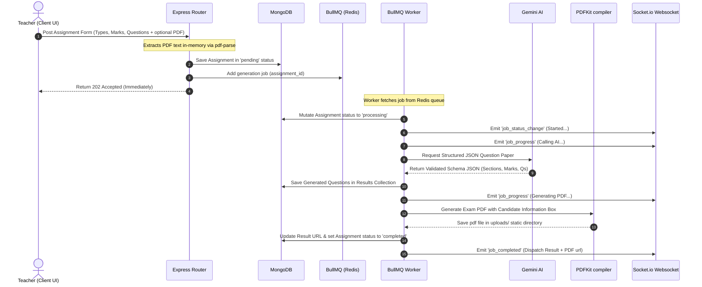

# VedaAI AI Assessment Creator - Backend System

This is the backend service for the **AI Assessment Creator**, built with Node.js, Express, TypeScript, MongoDB, Redis, BullMQ, and Socket.io. 

It provides an asynchronous question paper generator that takes exam requirements (and optional PDF/Text source attachments), compiles a mathematically precise structure via Google Gemini, programmatically creates styled exam PDFs, and uses real-time WebSockets to notify teachers of creation progress.

---

## Technical Stack & Roles

*   **Node.js & Express (TypeScript)**: Highly structured, ESM-compliant runtime.
*   **Mongoose (MongoDB)**: Structured data mapping for Assignments and Generated Papers.
*   **Redis**: High-performance transport layer supporting our worker queues and status tracking.
*   **BullMQ**: Background job executor isolating long-running LLM generation and PDF creation tasks.
*   **Socket.io**: Real-time push notification layer communicating execution steps directly to frontend browser clients.
*   **@google/genai**: Google's latest Gemini AI SDK leveraging JSON-Schema Structured Outputs to guarantee structural response accuracy.
*   **PDFKit**: Programmatic creation of high-fidelity, dual-pane exam sheets (includes name/roll info line entries).
*   **pdf-parse**: Extracts plain text from uploaded syllabus/study PDF guides in-memory.

---

## Architectural Workflow Flow



---

## Configuration & Environment Variables

Copy the `.env.example` file to `.env` in the backend folder:

```bash
cp .env.example .env
```

And configure the values:

| Variable | Description | Default |
| :--- | :--- | :--- |
| `PORT` | The HTTP Server port | `5000` |
| `MONGO_URI` | MongoDB connection URL | `mongodb://localhost:27017/veda-ai` |
| `REDIS_HOST` | Redis Server IP address | `127.0.0.1` |
| `REDIS_PORT` | Redis Server port | `6379` |
| `GEMINI_API_KEY` | Official Google Gemini API Key | *Required* |

---

## Quickstart Guide

### 1. Requirements
*   Node.js (v18 or higher)
*   MongoDB running locally or in cloud
*   Redis running locally or in cloud

### 2. Install Packages
```bash
npm install
```

### 3. Start Development Server (Hot Reloading)
```bash
npm run dev
```

### 4. Build and Run in Production Mode
```bash
npm run build
npm run start
```

---

## Core API Endpoints

### 1. Assessment Routes
*   `POST /api/assignments`
    *   **Description**: Submits requirements and schedules background generation.
    *   **Content-Type**: `multipart/form-data`
    *   **Body Parameters**:
        *   `due_date` (Date string, e.g. `"2026-06-15"`)
        *   `question_types` (Array of Strings: e.g. `["MCQ", "Short Answer"]`)
        *   `number_of_questions` (Number)
        *   `total_marks` (Number)
        *   `additional_instructions` (String, optional)
        *   `file` (Binary File: PDF/Text, optional)
    *   **Response**: `202 Accepted`

*   `GET /api/assignments`
    *   **Description**: Lists all created assignments populated with their generated results.
    *   **Response**: `200 OK`

*   `GET /api/assignments/:id`
    *   **Description**: Retrieves single assignment details and its generated question paper details.
    *   **Response**: `200 OK`

*   `POST /api/assignments/:id/regenerate`
    *   **Description**: Trashes existing questions and queues a fresh AI generation run.
    *   **Response**: `202 Accepted`

### 2. Utility Routes
*   `GET /api/status`
    *   **Description**: Live health status checking MongoDB and Redis connections.
    *   **Response**: `200 OK` (if all green) or `503 Service Unavailable`

*   `GET /uploads/:filename`
    *   **Description**: Serves static generated print-ready question paper PDF sheets.

---

## Real-Time WebSocket Events

Frontend clients connect to the server and join specific rooms to receive granular generation feedback:

1.  **Join Room**: Emit `join_assignment` passing the `assignment_id`.
2.  **Server Events dispatched**:
    *   `joined`: Confirms the socket successfully connected to the assignment updates channel.
    *   `job_status_change`: Dispatched when worker changes state (e.g. `processing`).
    *   `job_progress`: Contains progress integer percentages (`25`, `60`, `80`) and descriptive actions.
    *   `job_completed`: Delivers the complete finalized `assignment` and `result` payload.
    *   `job_failed`: Notifies client of failure details.
